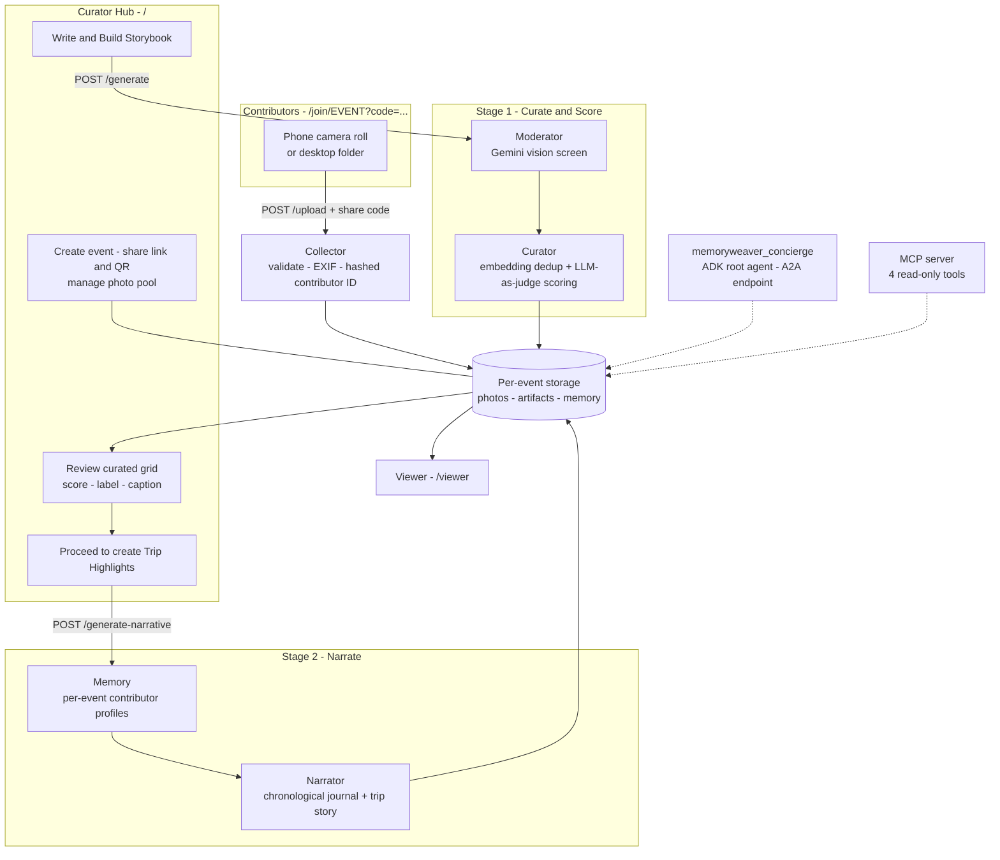

# MemoryWeaver 🧵📸


**Turn a family's chaotic post-event photo dump into a curated, narrated keepsake journal - with a team of AI agents.**

After every trip, birthday, or wedding, the photos scatter: hundreds on Mom's phone, more on Dad's, a few gems on Grandma's. Someone (usually a busy parent) is supposed to collect them all, delete the blurry ones, pick the best, and make something worth keeping. Nobody ever does.

MemoryWeaver does the heavy lifting. Family members upload photos through a shareable link - no accounts, no app installs. A five-agent pipeline moderates, de-duplicates, scores, and narrates them into a journal of chronological moments with landmark-aware captions and a flowing trip story. The organizer stays in control: the pipeline runs in **two stages with a review step in between**, so nothing is written until the curated photos are approved. Every event (a weekend trip, a soccer final, a wedding) lives in its own isolated session.

---

## How it works

Three pages, two kinds of people:

| Page | For | What it does |
|---|---|---|
| **Contributor page** `/join/<event>?code=…` | Family and friends | Mobile-first: enter a name, pick photos (or a whole folder on desktop), upload. Shows a "journal is ready" link once the journal exists. |
| **Curator Hub** `/` | The organizer | Create events, share the link/QR, manage the photo pool, run the pipeline, review the curated grid, approve. |
| **Viewer** `/viewer` | Everyone | Highlights reel with per-moment filter tabs, the day-by-day journal, the trip story, and a per-contributor filter. |



**Two ways to drive the same system:**
- The **web product** above.
- The **agent layer**: the `memoryweaver_concierge` (served over A2A, or via `agents-cli playground`) lists and creates events, launches the pipeline, and reads results back conversationally, with the five specialists attached as sub-agents. From chat the pipeline runs end to end in one go (there is no review step in that path). An MCP server exposes the event data to any MCP client (e.g. Claude Desktop).

**Design note - deterministic pipeline, agentic control plane.** The heavy per-photo work (vision moderation, scoring, journaling) runs as orchestrated Python that calls the agents' Gemini-powered tools in *batches*, rather than routing every photo through LLM tool-calling. For a 200-photo event that is about **20 generation calls** (4 moderation batches, 14 scoring batches, journal + story) **plus one lightweight embedding call per photo**, instead of hundreds of agent turns. The concierge agent works at the *task* level, where reasoning adds value.

### The two stages

| Stage | Phase | Agent | What happens |
|---|---|---|---|
| **1. Curate & Score** (button: *✨ Write & Build Storybook Now*) | 1. Moderation | Moderator | Gemini vision screens batches of 50 for safety, sharpness, and "real photo, not a screenshot/meme/document". |
| | 2. Deduplication | Curator | Gemini image embeddings (`gemini-embedding-2`, 768 dims) + cosine similarity. A photo more than 0.92 similar to one already kept is dropped as a burst duplicate (the first in filename order is kept). |
| | 3. Scoring | Curator | LLM-as-judge rates sharpness, composition, uniqueness, and human presence (weighted toward people), names the scene/landmark from GPS + vision, and writes a caption (batches of 15). A diversity filter then picks the target number of photos spread across scenes. |
| **2. Narrate** (button: *Love the Curated Highlights – Proceed to create Trip Highlights*) | 4. Memory | Memory | Records who contributed to which moments (per event). |
| | 5. Narration | Narrator | One batched call writes every moment's journal entry, then the trip story. Moments are ordered by **capture time** (EXIF, else file time). |

Between the stages the Hub shows the **curated grid**: every photo with its score and scene/location label (hover for the caption), tabs for *Curated Highlights / Other Photos / Hidden*, and a ✕ / ✓ button to move photos in or out before you approve.

**Reliability.** Results are cached per photo, so re-runs are near-free. If a Gemini call fails, the run **aborts without touching the event's existing highlights, journal, or story**, nothing failed is cached, and cache entries poisoned by earlier failures are recomputed. Each completed stage records `vibe_trajectory.json` (see [Run record](#run-record)).

---

## Key architecture concepts

| Concept | Where |
|---|---|
| **Agent / multi-agent system (ADK)** | [`memoryweaver/app/agent.py`](memoryweaver/app/agent.py) - root concierge with 6 tools and 5 sub-agents; the specialists live in [`memoryweaver/agents/`](memoryweaver/agents/). The A2A agent card exposes 23 skills. |
| **MCP server** | [`memoryweaver/mcp_server.py`](memoryweaver/mcp_server.py) - 4 read-only tools over stdio (`list_event_sessions`, `get_contributor_profiles`, `get_event_journal`, `find_missed_moments`), deliberately unable to bypass the web auth layer. |
| **Security** | Admin token, per-event share code, EXIF-stripping media endpoint, prompt sanitizer - see [Security model](#security-model) and [`CONTEXT.md`](CONTEXT.md). |
| **Evaluation (Agents CLI)** | [`memoryweaver/tests/eval/`](memoryweaver/tests/eval/eval_config.yaml) - see [Tests and evaluation](#tests-and-evaluation). |
| **Agents CLI** | Project scaffolded and driven with `agents-cli` ([`memoryweaver/agents-cli-manifest.yaml`](memoryweaver/agents-cli-manifest.yaml)); `agents-cli playground` runs the concierge. |
| **Deployability** | [`memoryweaver/Dockerfile`](memoryweaver/Dockerfile) + [`memoryweaver/deployment/terraform/`](memoryweaver/deployment/terraform/) + `agents-cli deploy` (Cloud Run) - see [Deployment](#deployment) for caveats. |

---

## Quick start

**Prerequisites:** Python 3.11–3.13, [uv](https://docs.astral.sh/uv/), and a [Google AI Studio API key](https://aistudio.google.com/apikey).

```bash
git clone <this-repo> && cd MemoryWeaver/memoryweaver

uv sync                          # core dependencies only
cp ../.env.example .env          # then edit: set GEMINI_API_KEY=<your key>

uv run uvicorn app.fast_api_app:app --port 8000
```

Open **http://localhost:8000** - the Curator Hub, with a default event ready. (Optional: `uv sync --extra drive-import` enables `scripts/drive_downloader.py`, a standalone Google Drive importer.)

### The full loop (about 5 minutes)

1. **Step 1 – Choose or create an event.** Pick a name and a type (trip / birthday / wedding / sports match / reunion / other). Each event has Edit, Copy Link, Copy QR, and Delete controls.
2. **Step 2 – Add photos.** Send the **share link or QR** (Copy Link / Copy QR) to everyone; they open it on their phones, enter a name, and upload. Desktop contributors can upload a whole folder. If you run the app on your own computer you can also add photos with **Find Your Photos → Add to Album**, a server-side file browser.
   The **📦 Album Photos** tray (shown once photos exist) lists everything collected; use its **Included / Excluded** tabs to take photos out of curation before the agents see them.
3. **Step 3 – Write & build.** Choose a target journal size and click **✨ Write & Build Storybook Now**. Watch the live log and progress bar (*Phase 1/5 … 3/5*).
4. **Review.** The curated grid appears with scores and labels. Move photos between *Curated Highlights* and *Other Photos* with ✕ / ✓.
5. **Proceed.** Click **Love the Curated Highlights – Proceed to create Trip Highlights**. The Narrator writes the journal and story.
6. **Open the viewer.** *Daily Highlights Reel* (the 12 top-scored approved photos, with a filter tab for each highlighted moment), *Day-by-Day Journal* (moments in capture-time order, each with a date and up to three photos), *Our Story*, and a contributor filter that dims moments someone missed and lists the ones they should catch up on. Contributors' share pages now show a "journal is ready" link.

> **Re-generating a finished event:** click *Write & Build Storybook* again (mostly cached and cheap) and then *Proceed*. Do **not** press *Proceed* alone a second time - see [Known limitations](#known-limitations).

### Talk to the agent

```bash
uv run adk web          # choose "app" in the dropdown - or: agents-cli playground
```

Try: *"What events do I have?"* → *"Create an event called Summer Soccer Final, it's a sports match"* → *"Run the curation pipeline on it"* → *"Read me the story."* The concierge shares state with the web app: events created in either place appear in both.

### MCP server (Claude Desktop, etc.)

```json
{
  "mcpServers": {
    "memoryweaver": {
      "command": "uv",
      "args": ["run", "--directory", "/path/to/MemoryWeaver/memoryweaver", "python", "mcp_server.py"]
    }
  }
}
```

Then ask your MCP client: *"Who contributed photos to my default event, and which moments did they miss?"*

---

## Tests and evaluation

```bash
cd memoryweaver
uv run pytest tests/unit tests/integration     # the integration tests call Gemini and need GEMINI_API_KEY
agents-cli eval generate && agents-cli eval grade
```

- **Unit tests** (offline, Gemini calls stubbed) cover upload security, prompt sanitizing, failure handling (a failed run never wipes artifacts or poisons the cache), duplicate detection and its threshold, chronological ordering, the run record, and the folder-picker guards. A drift test also keeps this README honest: its links, anchors, UI labels, endpoints, and counts must match the code. *Note:* `test_security.py` leaves a small `*passwd_trip.jpg` stub in `local_storage/uploads/`; delete it before curating the default event.
- **Integration tests** stream the real concierge agent and exercise the FastAPI server.
- **Agent evals** (`memoryweaver/tests/eval/`, 7 cases): a deterministic **tool-trajectory** check (did the agent call the right tool, and avoid forbidden ones) and an **LLM response-quality judge** that uses the same AI Studio key. They run locally because the managed Vertex autoraters reject multi-agent traces.
- [`memoryweaver/specs/behavior.feature`](memoryweaver/specs/behavior.feature) states the pipeline's target behavior in Gherkin; it is documentation, not an executed test suite.

## Run record

Every completed stage records `vibe_trajectory.json` in the event's `artefacts/` folder (a failed run writes nothing). It merges both stages, so after *Proceed* it holds all five phases: per-phase duration and cache hits, per-stage metadata (photo counts, uncached work, embedding calls), and **estimated** token usage and cost per stage plus a total. The usage figures are estimates (fixed per-item token guesses × list prices), not metered usage, and the per-photo embedding calls are counted but not priced.

On a 15–17-photo event we measured about 50 seconds to curate and 20 seconds to narrate, at an estimated total cost under one cent; cached re-runs take seconds.

---

## Security model

| Tier | Who | Credential |
|---|---|---|
| **Admin** - creating/editing/deleting events, `/generate`, `/generate-narrative`, photo-pool and curation edits, share-link lookup, the server-side file browser | Event organizer | `MW_ADMIN_TOKEN` → `X-MW-Token` header. Open when unset (local development); **required for any shared deployment**. |
| **Upload** - `POST /upload` | Family with the link | Per-event `share_code` embedded in the `/join` link; no accounts. |
| **Read-only** - viewer, `/media`, `/api/trip-book`, progress/log endpoints, event list | Anyone with a link | Open. Photos are re-encoded with **all EXIF stripped** (GPS, device IDs); only curated artifacts are reachable, never raw storage; share codes are never included in event listings. |

Also:
- **Uploads:** 20 MB cap, extension allow-list (`.jpg`, `.jpeg`, `.png`, `.heic`), filenames reduced with `os.path.basename`.
- **Prompt injection:** uploaded filenames are sanitized (newlines, quotes, braces, tags removed; length capped) before they enter scoring or journal prompts. This blocks structure-based injection; it does not filter ordinary words, and it does not cover text hidden inside images.
- **Identity:** contributor IDs in filenames and logs are 12-character SHA-256 hashes of the name. The names themselves are kept in the event's memory bank and shown in the viewer's contributor filter.
- **Location data:** original files keep their EXIF. GPS coordinates are read at scoring time and sent to Gemini to name places; they are never served back out (the `/media` endpoint strips them).
- **Server-side file browser:** browses the host machine's disk, so it needs the admin token and is switched off automatically on Cloud Run (or anywhere `MW_DISABLE_LOCAL_FS=1`); it only copies photo files.

## Project structure

```
MemoryWeaver/
├── README.md  CONTEXT.md  .env.example
├── .agents/skills/            # SKILL.md guidance for coding assistants (not loaded at runtime)
└── memoryweaver/
    ├── app/
    │   ├── agent.py           # memoryweaver_concierge (root ADK agent, A2A)
    │   ├── fast_api_app.py    # Web app: Curator Hub, contributor page, pipeline API
    │   └── app_utils/         # SessionStore, session-scoped StorageHelper, telemetry
    ├── agents/                # The five specialists (agent.py + tools/ each)
    │   └── collector/  moderator/  curator/  memory/  narrator/
    ├── pipeline/
    │   ├── orchestrator.py    # Two-stage batched pipeline (the workhorse)
    │   ├── prompt_safety.py   # Prompt-injection sanitizer
    │   └── local_cleaner.py   # EXIF/date helpers (its on-device CLIP pre-clean is currently unwired)
    ├── mcp_server.py          # MCP stdio server (4 read-only tools)
    ├── frontend/              # upload.html (Curator Hub) · contribute.html · viewer.html
    ├── scripts/               # drive_downloader.py (optional Drive importer)
    ├── specs/                 # behavior.feature (Gherkin, documentation)
    ├── tests/                 # unit/ · integration/ · eval/
    ├── deployment/terraform/  # Cloud Run infrastructure
    └── Dockerfile  agents-cli-manifest.yaml  pyproject.toml
```

Each event is stored under `memoryweaver/local_storage/sessions/<event>/` (`uploads/`, `thumbs/`, `artefacts/`, `memory_bank.json`); `artefacts/` holds `manifest.json`, `highlights.json`, `journal.json`, `story.txt`, `curation_cache.json`, and `vibe_trajectory.json`.

## Deployment

To deploy to Google Cloud Run:

```bash
gcloud config set project <your-project-id>
agents-cli deploy
```

The Terraform under `memoryweaver/deployment/terraform/` provisions Cloud Run, GCS buckets, and telemetry (Cloud Trace / BigQuery logs). For any non-local deployment set:

- `GEMINI_API_KEY` - model access
- `MW_ADMIN_TOKEN` - **mandatory**; gates all destructive and billable endpoints
- `APP_URL` - public base URL, so share links and QR codes are absolute

**Caveat - treat a deployment as a single-instance demo.** The curation pipeline, `/media`, and the viewer read photos and artifacts from the instance's local disk, and progress/log state lives in memory. Setting `GCS_BUCKET_NAME` makes uploads and the event index go to Cloud Storage, but the pipeline does not yet read from it, so a GCS-backed deployment is **not supported end to end**. Run one instance with a persistent disk, or run locally.

## Known limitations

- **Pressing *Proceed* twice shrinks the journal.** After *Proceed*, `highlights.json` is reduced to the top 12 photos, and a second *Proceed* narrates only those. To regenerate, run *Write & Build Storybook* again first. Re-running that step also resets the journal until you press *Proceed*.
- **Moments follow the AI's scene labels.** Photos taken at the same time can be labelled differently and become separate (but adjacent) moments.
- **Duplicate detection is conservative and unproven on real bursts.** The 0.92 threshold was calibrated on stock photos with synthetic burst copies (near-duplicates scored ≥ 0.943; different shots of one subject up to about 0.87). Very similar shots can still merge, and the first photo in filename order is kept, not the sharpest.
- **Memory is per event.** There are no cross-event contributor profiles yet.
- **Photos only** - videos are filtered out at upload; video moderation and curation are roadmap.
- **Estimates, not metering.** Token and cost figures are estimates.
- **Share codes travel in the URL** - the right trade-off for "grandma scans a QR" (versus accounts/OAuth), but links should be shared as privately as the photos themselves.
- **The server-side file browser only works when the app runs on your own computer;** on a cloud deployment it reports an error - use the share link.
- Agent evals are small (7 cases).

## Roadmap

A repeatable *Proceed* (keep the approved list separate from the highlights reel), event-type-aware narration (a soccer final shouldn't read like a travel diary), cross-event contributor memory, a GCS-backed pipeline, video support, face-aware people naming with an opt-in roster, and per-contributor "you missed this moment" digests.
