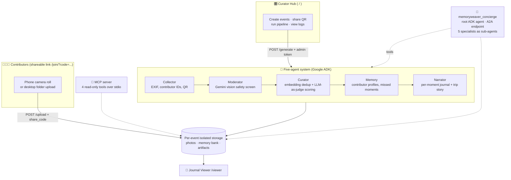

# MemoryWeaver 🧵📸


**Turn a family's chaotic post-event photo dump into a curated, narrated keepsake journal — automatically, with a team of AI agents.**

After every trip, birthday, or wedding, the photos scatter: hundreds on Mom's phone, more on Dad's, a few gems on Grandma's. Someone (usually a busy parent) is supposed to collect them all, delete the blurry ones, pick the best, and make something worth keeping. Nobody ever does.

MemoryWeaver does. Family members upload photos through a shareable link — no accounts, no app installs. A five-agent pipeline moderates, de-duplicates, scores, and narrates them into a journal with per-moment entries, accurate landmark names, and a flowing trip story. Every event (a weekend trip, a soccer final, a wedding) lives in its own isolated session.

---

## Architecture



**Two ways to drive the same system:**
- The **web product**: contributors upload via the share link; the admin runs the pipeline from the Curator Hub; everyone reads the result in the viewer.
- The **agent layer**: the `memoryweaver_concierge` (served over A2A, or via `agents-cli playground`) manages events, launches the pipeline, and discusses results conversationally — with the five specialists attached as sub-agents for fine-grained follow-ups ("who missed the beach day?"). An MCP server exposes the same memory bank to any MCP client (e.g. Claude Desktop).

**Design note — why the pipeline is deterministic:** the heavy per-photo work (vision moderation, LLM-as-judge scoring, batched journaling) runs as orchestrated Python that calls the agents' Gemini-powered tools in batches, rather than routing every photo through LLM tool-calling. For a 200-photo dump this is the difference between ~15 batched API calls and hundreds of agent turns — same quality, fraction of the cost and latency. The concierge agent operates at the *task* level, where reasoning actually adds value.

### Pipeline phases

The pipeline executes in two user-controlled sequential stages:
1. **Curate & Score:** Runs Moderation, Deduplication, Scoring, and Memory mapping, then displays the proposed photo highlights to the admin in Step 3.
2. **Narrate & Finalize:** Triggered via the **Proceed** button once the curated photo grid is approved, running the Narrator agent to write the final journal and stories.

| Phase | Agent | What happens |
|---|---|---|
| 1. Moderation | Moderator | Gemini vision screens batches of 50: safety, sharpness, real-photo-vs-screenshot |
| 2. Deduplication | Curator | Gemini image embeddings (`gemini-embedding-2`, 768 dims) + cosine similarity drop burst duplicates (threshold 0.92, calibrated on real photos) |
| 3. Scoring | Curator | LLM-as-judge rates sharpness/composition/uniqueness/human-presence, names landmarks from GPS + vision, writes captions (batches of 15) |
| 4. Memory | Memory | Updates per-contributor profiles: who was present at which moments |
| 5. Narration | Narrator | One batched call writes every moment's journal entry, then the trip story |

Results are cached per photo, so re-runs are near-free.

---

## Key Architecture Concepts

| Concept | Where |
|---|---|
| **Agent / Multi-agent system (ADK)** | [`app/agent.py`](app/agent.py) — root concierge with 6 tools + 5 sub-agents; specialists in [`agents/*/agent.py`](agents/); A2A card exposes 23 skills |
| **MCP server** | [`mcp_server.py`](mcp_server.py) — 4 read-only tools over stdio, deliberately unable to bypass the web auth layer |
| **Security features** | Admin-token gate on destructive/billable endpoints; per-event `share_code` upload credential; EXIF-stripping `/media` endpoint (raw GPS never leaves the server); prompt-injection sanitizer ([`pipeline/prompt_safety.py`](pipeline/prompt_safety.py)); STRIDE notes in [`CONTEXT.md`](../CONTEXT.md) |
| **Agent skills (Agents CLI)** | Project scaffolded and driven with `agents-cli` (see [`agents-cli-manifest.yaml`](agents-cli-manifest.yaml)); `agents-cli playground` runs the concierge |
| **Agent Evaluation (Agents CLI)** | [`eval/eval_config.yaml`](eval/eval_config.yaml) and [`eval/datasets/basic-dataset.json`](eval/datasets/basic-dataset.json) — automated LLM-as-judge quality & safety evaluation pipeline |
| **Deployability** | [`Dockerfile`](Dockerfile) + [`deployment/terraform/`](deployment/terraform/) + `agents-cli deploy` (Cloud Run); see [Deployment](#deployment) |

---

## Quick start

**Prerequisites:** Python 3.12+, [uv](https://docs.astral.sh/uv/), a [Google AI Studio API key](https://aistudio.google.com/apikey) (free tier works).

```bash
git clone <this-repo> && cd MemoryWeaver/memoryweaver

# Install dependencies
uv sync

# Configure
cp ../.env.example .env      # then edit: set GEMINI_API_KEY=<your key>

# Run the web app
uv run uvicorn app.fast_api_app:app --port 8000
```

Open **http://localhost:8000** — the Curator Hub, with a default event ready.

### The full loop (5 minutes)

1. **Create an event** in the session bar (name + type: trip / birthday / wedding / sports match / reunion).
2. **Share & Collect** — copy the contributor link or let family scan the QR. They open it on their phones: name, pick photos, done. Desktop contributors can upload a whole folder at once.
3. **Manage the Photo Pool** — expand the collapsible "View Uploaded Photo Pool" tray right under the upload status. Toggle photos in/out of the curation pipeline using the **Included** and **Excluded** tabs and the `❌` / `➕` overlays.
4. **Curate & Score** — click **▶ Curate & Score Now** and watch the live agent logs and progress bar. Once complete, inspect the generated curation grid (showing scores, labels, and captions).
5. **Narrate & Finalize** — click the **"Love the Curated Highlights - Proceed to create Trip Highlights"** button at the bottom of the grid to execute the final narration and write stories/journals.
6. **Viewer with Sub-Event Filters** — open the viewer to see the highlights carousel, moment-by-moment journal with captions, and full trip story. Use the new **dynamic sub-event filter tabs** (e.g. 🌟 Overall Highlights, 📍 specific moments) to interactively explore curated moments. Contributor share links will update to show the *"journal is ready"* link.

### Talk to the agent

```bash
uv run adk web          # pick "app" — or: agents-cli playground
```

Try: *"What events do I have?"* → *"Create an event called Summer Soccer Final, it's a sports match"* → *"Run the curation pipeline on it"* → *"Read me the story."* The concierge shares state with the web app — events created in either place appear in both.

### MCP server (Claude Desktop, etc.)

```json
{
  "mcpServers": {
    "memoryweaver": {
      "command": "uv",
      "args": ["run", "--directory", "/path/to/MemoryWeaver/memoryweaver", "python", "mcp_server.py"]
    }
  }
}
```

Then ask your MCP client: *"Who contributed photos to my default event, and which moments did they miss?"*

---

## Security model

| Tier | Who | Credential |
|---|---|---|
| Admin (`/generate`, `/delete`, ingest, event creation) | Event organizer | `MW_ADMIN_TOKEN` env var → `X-MW-Token` header (open in local dev when unset; **required for any shared deployment**) |
| Upload (`POST /upload`) | Family with the link | Per-event `share_code`, embedded in the `/join` link — no accounts needed |
| Read-only (viewer, `/media`, `/api/trip-book`) | Everyone with a link | Open, but photos are re-encoded with **all EXIF stripped** (GPS, device IDs), and only curated artifacts are reachable — never raw storage |

Also: filenames are sanitized before entering Gemini prompts (injection guard), upload validation (20MB cap, type allowlist, path-traversal-safe), and contributor IDs are hashes rather than raw names in filenames and logs.

## Project structure

```
memoryweaver/
├── app/
│   ├── agent.py            # memoryweaver_concierge (root ADK agent, A2A)
│   ├── fast_api_app.py     # Web app: Curator Hub, contributor page, pipeline API
│   └── app_utils/          # SessionStore, session-scoped StorageHelper
├── agents/                 # The five specialists (agent.py + tools/ each)
│   ├── collector/  moderator/  curator/  memory/  narrator/
├── pipeline/
│   ├── orchestrator.py     # 5-phase batched pipeline (the workhorse)
│   ├── local_cleaner.py    # On-device CLIP pre-cleaning (bulk import)
│   └── prompt_safety.py    # Prompt-injection sanitizer
├── mcp_server.py           # MCP stdio server (4 read-only tools)
├── frontend/               # upload.html (admin) · contribute.html · viewer.html
├── tests/                  # Unit (security) + integration (agent stream)
└── deployment/terraform/   # Cloud Run infrastructure
```

## Deployment

To deploy this application to Google Cloud Run:

```bash
gcloud config set project <your-project-id>
agents-cli deploy
```

The Terraform under `deployment/terraform/` provisions Cloud Run, GCS buckets, and telemetry (Cloud Trace / BigQuery logs). For any non-local deployment, set:

- `GEMINI_API_KEY` — model access
- `MW_ADMIN_TOKEN` — **mandatory**; gates all destructive/billable endpoints
- `APP_URL` — public base URL, so share links and QR codes are absolute
- `GCS_BUCKET_NAME` / `GOOGLE_CLOUD_PROJECT` — switches storage from local disk to GCS

## Known limitations

- **Photos only** — videos are filtered out at upload; video moderation/curation is roadmap.
- Pipeline progress/log state is in-memory per process — fine for a family-scale single instance, needs Redis/Firestore for multi-instance serving.
- The `share_code` travels in the URL query string — the right trade-off for "grandma scans a QR" (vs. accounts/OAuth), but links should be shared as privately as the photos themselves.

## Roadmap

Event-type-aware narration (a soccer final shouldn't read like a travel diary), video support, face-aware people naming with an opt-in roster, and per-contributor "you missed this moment" digest emails.
