# MemoryWeaver: Frictionless Group Trip Photo Agent

MemoryWeaver is a multi-agent AI system built using the Google Agent Development Kit (ADK) 2.0 to solve the challenge of collecting, moderating, curating, and narrating photos from group trips. It uses a sequential Agent-to-Agent (A2A) pipeline consisting of 5 specialized agents to turn raw photo dumps into structured trip journals, highlights, stories, and personalized memories.

## System Architecture: Sequential A2A Pipeline

```mermaid
graph TD
    classDef ingress fill:#2c3e50,stroke:#34495e,stroke-width:2px,color:#fff;
    classDef filter fill:#7b241c,stroke:#922b21,stroke-width:2px,color:#fff;
    classDef rank fill:#115e48,stroke:#0f4c3a,stroke-width:2px,color:#fff;
    classDef memory fill:#b7950b,stroke:#9a7d0a,stroke-width:2px,color:#fff;
    classDef output fill:#1f618d,stroke:#1a5276,stroke-width:2px,color:#fff;

    A["<b>Agent 1: Collector</b><br/><i>Ingress (Zero Friction)</i><br/>• Accepts files (HEIC/JPG/PNG)<br/>• Extracts EXIF GPS & time<br/>• Generates dynamic QR code<br/>• Creates anonymous contributor ID"]
    class A ingress;

    B["<b>Agent 2: Moderator</b><br/><i>Safety & Quality Guardrail</i><br/>• Runs Gemini Vision safety filter<br/>• Excludes memes & screenshots<br/>• Quarantines blurry/black frames<br/>• Evaluates upload threat surface"]
    class B filter;

    C["<b>Agent 3: Curator</b><br/><i>Deduplication & Shortlisting</i><br/>• Clusters photos via Embeddings<br/>• Cosine similarity deduplication<br/>• Scores photos 0-10 (LLM-as-Judge)<br/>• Generates ranked JSON manifest"]
    class C rank;

    D["<b>Agent 4: Memory</b><br/><i>Cross-Session Profiles</i><br/>• Tracks contributor uploads<br/>• Stores personal preferences<br/>• Recommends 'what you missed'<br/>• Stores trip context"]
    class D memory;

    E["<b>Agent 5: Narrator</b><br/><i>Artefact Synthesis</i><br/>• Weaves daily narrative journals<br/>• Compiles top photo highlight reel<br/>• Creates cohesive Trip Story<br/>• Triggers digests & HITL approval"]
    class E output;

    A -->|Raw photo list & EXIF| B
    B -->|Approved photos only| C
    C -->|Ranked photo JSON manifest| D
    D -->|User context & trip profile| E
    E -->|Final Artefacts: Journal, Reel, Story| User([End Users / Viewers])
```

## Responsibility Split

To deliver this project by July 4, tasks are split between two partners:

| Role / Domain | Partner A (Pipeline & Agents) | Partner B (Frontend, Artefacts & Infrastructure) |
| :--- | :--- | :--- |
| **Foundation** | Env setup, scaffolding, CONTEXT.md | GCS setup, upload UI sketch, data contract |
| **Core Agents** | Collector, Moderator (STRIDE), Curator | Upload page UI, QR code generator, Narrator Agent (core) |
| **Integration** | Memory Agent, A2A pipeline wiring | Narrator Agent (story, digest, HITL), Artefact Viewer UI |
| **Prod & Eval** | Cloud Run deployment, agents-cli eval report | Deployed URL testing, End-to-End demo scenarios |

## Design & UX Requirements: Mobile-First Focus

> [!TIP]
> Since the end users are group trip contributors uploading photos directly from their phone camera rolls, the user interface will be built with a **mobile-first design**:
> * **Zero Friction**: No login or download required; uploading should work directly within a mobile browser after scanning a QR code.
> * **Touch-Optimized**: Large tap targets (minimum 48x48px), simple file pickers supporting direct camera access, and a clean, responsive layout.
> * **Performance**: Light weight css, instant visual feedback/loading states for slow network connections (e.g. while on trips).
> * **Trip Phases Support**: The pipeline handles both **in-trip live additions** (real-time processing, mid-trip digests) and **post-trip aggregation** (batch upload of hundreds of photos from camera rolls, grouping and sorting retrospectively by EXIF timestamps).

## Core Artefact Typology (In-Trip & Post-Trip)

To deliver high value regardless of upload phase, the system will generate the following artifacts:
1. **Daily Highlights**: Top photos grouped by day, selected using the Curator Agent's composite scores.
2. **Location/Area Highlights**: Photos automatically clustered into spatial moments using EXIF GPS coordinates and scene-understanding (e.g., "Grand Canyon Rim Trail", "Hotel Dinner").
3. **Full Trip Highlights & Story**: A curated global album of the top-20 moments and a flowing first-person plural narrative journal weaving the entire experience together.
4. **Family-wise & Contributor-specific Highlights**: Using the Memory Agent's records of who is present in which photo, generating personalized "Your Moments" views (e.g., highlighting photos matching a specific contributor group or family unit while preserving overall trip context).

## Collaboration & Learning Model (Pair-Programming)

To maximize learning during this Capstone Project, we will apply three mixed learning strategies depending on the nature of the daily build task:
* **Boilerplate Scaffolding**: I will write the infrastructural hooks (Flask integration, directories, storage client initialization) to keep momentum.
* **Fill-in-the-Blanks**: I will prepare functional templates with clear target blocks (e.g. system instructions, LLM scoring metrics, Cosine Similarity thresholds) for you to write, test, and tune.
* **Interactive Code Walkthroughs**: For complex system tasks (e.g. A2A protocol wiring, STRIDE threat validation), I will implement the code and walk you through the structural rationale, security policies, and performance characteristics in our reports.

---

## Compressed Daily Schedule (June 29 - July 4)

### June 29 (Monday) — Foundation & Environment Setup (Spec-Driven Development)
* **Goal**: Define declarative schemas and manifests, scaffold the project, and connect services.
* **Synchronous Tasks (Coordinated)**:
  * **Spec-Driven Design**: Agree on the shared data contract—defining the precise JSON schemas for session state fields read/written by each agent (manifests, photo metadata, participant contexts) *before* writing any code.
* **Partner A (Asynchronous)**:
  * Initialize environment and install Google Antigravity CLI/IDE.
  * Define `agents-cli-manifest.yaml` specifying all 5 agents and their tool signatures.
  * Run `agents-cli create memoryweaver --prototype` using the manifest spec.
  * Write `CONTEXT.md` defining project-wide coding, security, and privacy standards.
  * Start implementing `Collector Agent` (EXIF extractor, file validations matching the spec).
* **Partner B (Asynchronous)**:
  * Setup Google Cloud project, enable GCS and Cloud Run APIs.
  * Create GCS buckets (`memoryweaver-uploads-dev` / `memoryweaver-artefacts-dev`).
  * Create mock upload UI (HTML skeleton matching the upload API spec).

### June 30 (Tuesday) — Moderator & Curator Agents
* **Goal**: Complete image filtering, scoring, and deduplication logic.
* **Synchronous Tasks**:
  * Code review for Curator's LLM-as-judge scoring prompt metrics.
* **Partner A (Asynchronous)**:
  * Implement `Moderator Agent`: sends photos to Gemini Vision to verify if appropriate, sharp, and not a screenshot. Rejects bad photos and logs reasons.
  * Implement STRIDE security checks and pytest validations on the upload surface.
  * Implement `Curator Agent`: generates image embeddings (Gemini Embedding 2), runs cosine similarity deduplication, scores via LLM-as-judge (0-10 on composition, sharpness, human presence, uniqueness), and outputs a structured JSON manifest.
* **Partner B (Asynchronous)**:
  * Complete upload web UI: integrate dynamic QR code generation (`qrcode` library) pointing to the upload URL.
  * Write pytest smoke tests for photo upload and GCS landing verification.

### July 1 (Wednesday) — Memory Agent & Narrator Agent (Core)
* **Goal**: Persistent profiles and initial artifact outputs.
* **Synchronous Tasks**:
  * Align on how Narrator uses Memory Agent context.
* **Partner A (Asynchronous)**:
  * Implement `Memory Agent` using Agent Runtime Memory Bank to track cross-session contributor profiles (`contributor_id`, `moments_present_in`, upload count).
  * Build the "You might have missed this" recommendation queries.
* **Partner B (Asynchronous)**:
  * Implement `Narrator Agent` (core): reads Curator's manifest, matches top photos for "Daily Highlights Reel" and "Best Shots Album" (downloadable ZIP).
  * Generate "Day-by-Day Journal": uses Gemini to write 2-3 sentence captions from photos + voice note transcripts.

### July 2 (Thursday) — A2A Wiring, Story, Digest, and HITL
* **Goal**: End-to-end pipeline execution on local environments.
* **Synchronous Tasks**:
  * End-to-end local test run with 30 sample photos.
* **Partner A (Asynchronous)**:
  * Wire all 5 agents together using the ADK A2A Protocol.
  * Enable tracing and observability tools inside the dev UI.
* **Partner B (Asynchronous)**:
  * Add the "Trip Story" generator: weaves together multiple days into a cohesive narrative.
  * Add "Mid-Trip Digest" triggers (triggered when photo counts pass threshold).
  * Build the Human-in-the-Loop (HITL) review gate for organizer approval.

### July 3 (Friday - Holiday) — Deployment & Testing (Asynchronous Only)
* **Goal**: Fully running on Cloud Run, tested remotely.
* **Partner A (Asynchronous)**:
  * Deploy all 5 agents to Google Cloud Run via `agents-cli deploy`.
  * Set up environment secrets (`GEMINI_API_KEY`, `GCS_BUCKET`, `PROJECT_ID`) in GCP Secret Manager.
  * Run final `agents-cli eval` to produce quality and performance report (`eval/report.json`).
* **Partner B (Asynchronous)**:
  * Build the final "Artefact Viewer" UI to display the generated highlights, journal, and personal "Your Moments" views.
  * Run client/mobile simulation tests: upload photos via simulated QR scanner on mobile web, verify end-to-end pipeline run on Cloud Run.

### July 4 (Saturday) — Hard Freeze, Bug Fixes & Buffer
* **Goal**: Frozen codebase, final verification.
* **Synchronous Tasks**:
  * Execute the final demo trip simulation (60 photos from 3 distinct contributors).
  * Perform any last-minute emergency bug fixes.
  * Freeze Git repository.
* **Both Partners (Asynchronous)**:
  * Draft Kaggle writeup (Problem, Solution, Architecture, Tech Decisions, Eval Results).
  * Prepare and record the demo video walk-through (max 5 minutes).

---

## Open Questions & Review Required

> [!IMPORTANT]
> 1. **GCP Project Details**: We need access to the GCP Project ID and API credentials for Cloud Storage and Gemini API. If not available, we will set up local storage/mock endpoints as a fallback on Day 1.
> 2. **Evaluation Metrics**: Do we want specific dimensions for the `agents-cli eval` report (e.g. strict latency bounds, or target mean quality score > 8.0)?

---

## Verification Plan

### Automated Tests
* Run `pytest` tests locally and on pre-commit hooks to verify:
  * Upload validation (oversized files, wrong MIME types, STRIDE payload injection).
  * Moderator agent quarantine logic.
  * Deduplication accuracy.
* Execute `agents-cli eval` to output quality benchmarks.

### Manual Verification
* Visual verification of the Upload page, processing dashboard, and Artefact Viewer UI on Chrome/Safari.
* Scanning generated QR code with physical iOS/Android cameras to verify frictionless upload flow.
